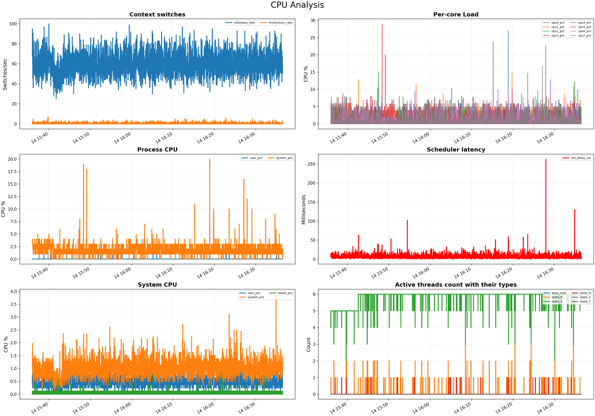
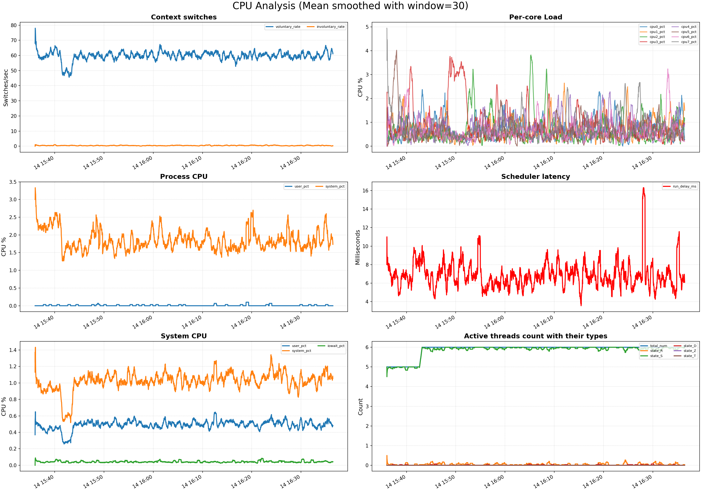
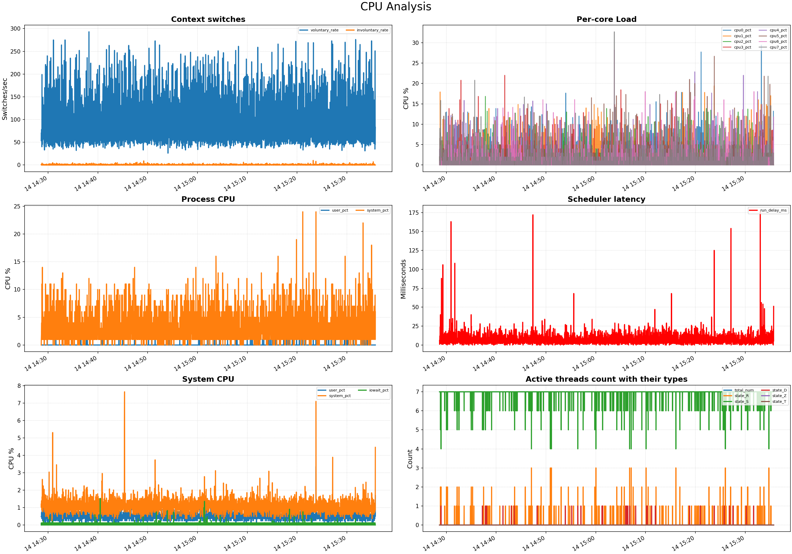
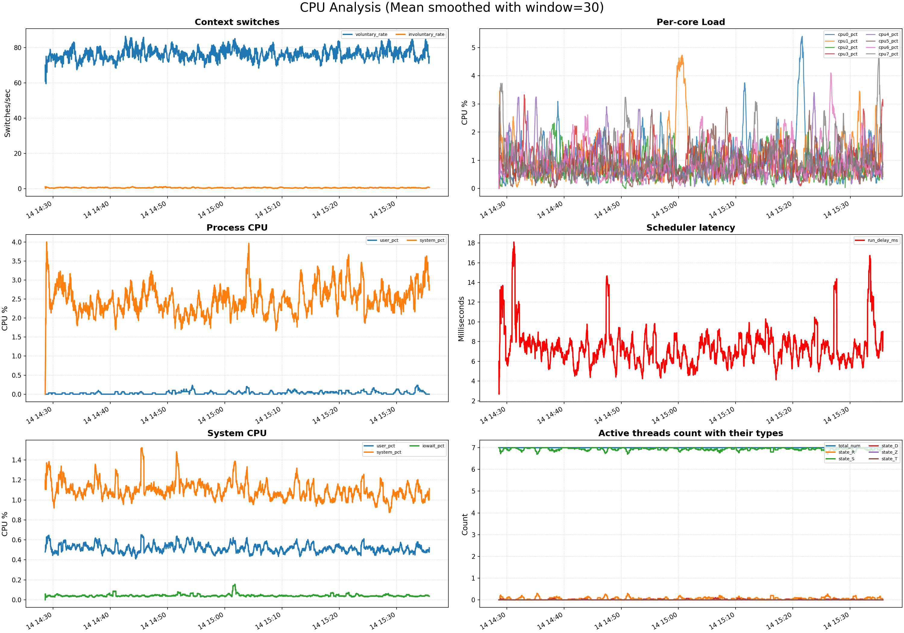
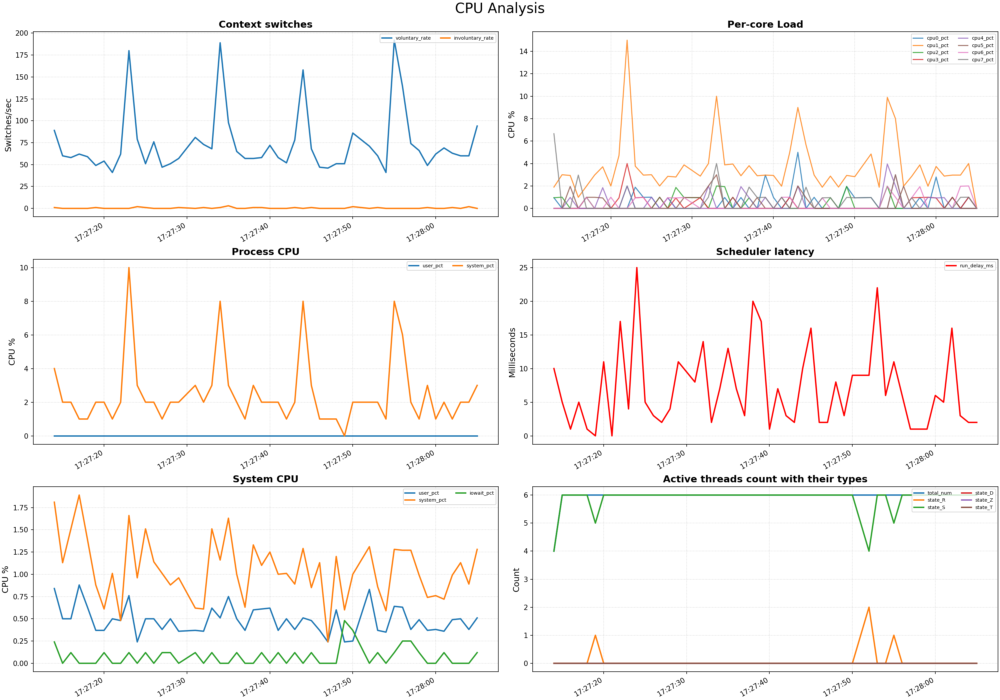
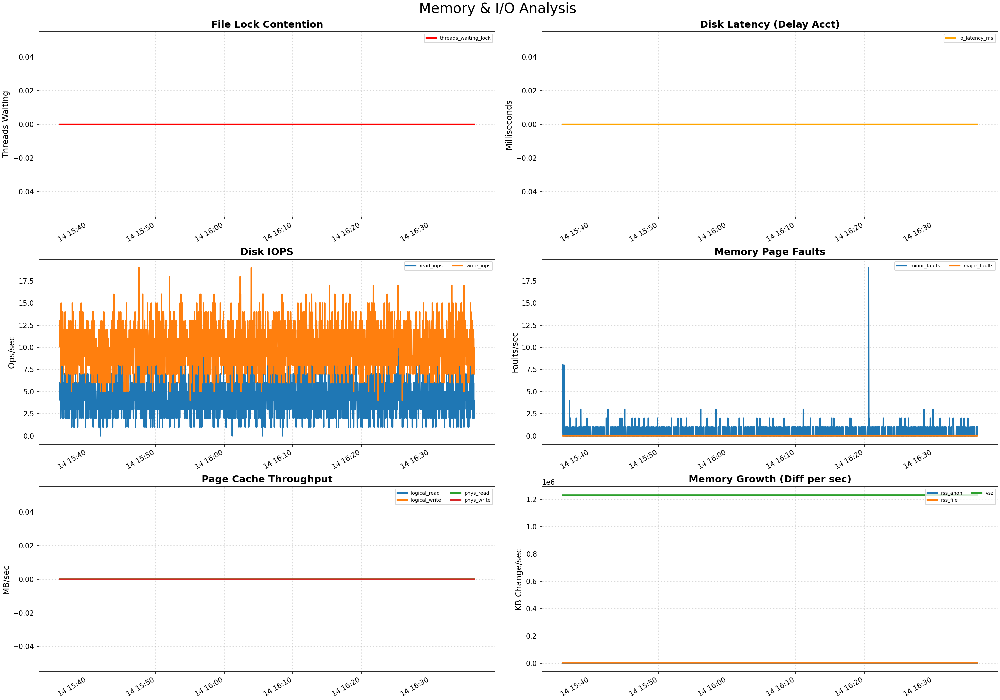
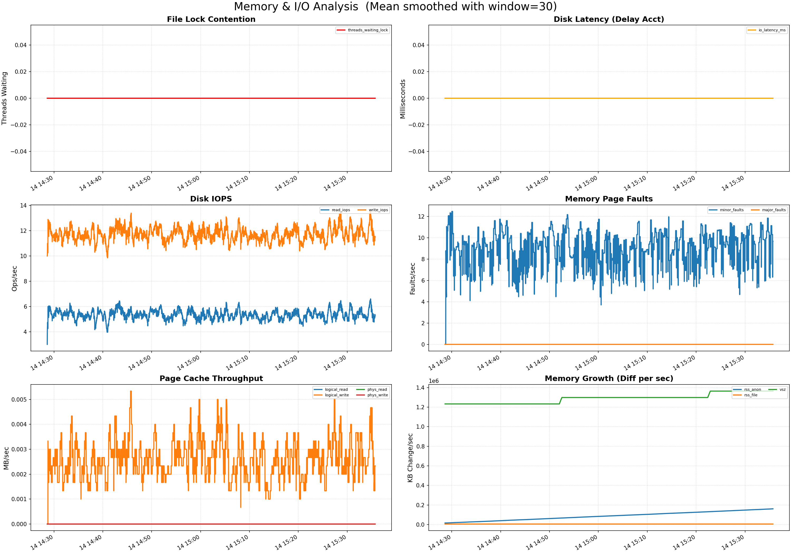

Выполнявший задание: Каримуллин Тимур

## Как запускать, как были написаны скрипты

Я писал все скрипты на обычном shell - в cpu папке у меня скрипты, которые мониторят метрики CPU и складывают результаты рядом в csv файл под тем же названием (меняют его только немного в зависимости от наличия нагрузки, чтобы не перетирать результаты часового тестирования), в mem папке аналогично. net часть делать не стал - слишком долго прогонять тесты каждый раз. У меня был мак, поэтому я создал вм `sandbox`, перекинул туда все файлы командой `multipass transfer -r bin cpu mem start_all.sh create_load.sh sandbox:/home/ubuntu/`, зашел внутрь вм командой `multipass shell sandbox` и запустил скрипт, который стартит бинарник и листенеры метрик `chmod +x start_all.sh && ./start_all.sh`. По истечению часа завершил исполнение командой `Ctrl + C`, вышел из multipass контейнера и вызвал команду `multipass transfer -r sandbox:/home/ubuntu/cpu/ sandbox:/home/ubuntu/mem/ ./` для получения файлов локально, после чего строил графики скриптами `cpu_plot.py` и `mem_plot.py`.

Глобально, все скрипты максимально прокомментированы - везде постарался пояснить по месту написания что и как сделано. Сначала прочитал бинарник, увидел там `go.1.25.6`, с этой спецификой (всего N потоков, которые го рантайм постоянно будет крутить и раскидывать по ним горутины) писал уже все шелльники, в основном доставал все из `/proc/<pid>`, только для распределения нагрузки по ядрам использовал `pidstat`.

Заметил так же что приложение открывает сервер на 8080 порту, поэтому запускал мониторинг под нагрузкой и без, нагрузку осуществлял курлом на `/`. Нагрузку давал небольшую, потому что бывает память сильно течет, а мнее ее должно хватить на час.

## CPU

Сначала без нагрузки:



На графике видно много шумов, поэтому сделал еще версию со сглаживанием по 30 секундам методом среднего:



Видно, что у нас небольшое простаивание потоков в очереди на исполнение (всего с десяток миллисекунд), однако на несглаженном графике видно что бывают сильные всплески - это указывает на периодические блокировки исполнения, такое может приводить к отказу сервера при больших нагрузках. Блокировки эти могут быть связаны  с вытеснением из-за долгого выделения памяти, это нехорошо и явно требует фикса после полноценного профилирования.

Потребление CPU в среднем в норме, хотя и немного завышено - видно что без нагрузки вся система в целом (в это практически только наш сервер) использует 2 процента от общего доступного процессорного времени, что довольно много если подразумевать что приложение занято единственно обработкой запросов. На несглаженном графике видны громадные выбросы, что может говорить о периодических зашкаливающе долгих вычислительных операциях, такое также может приводить к dos, и нагрузку необходимо сгладить или нивелировать совсем.

Анализ несглаженного графика распределения по ядрам затруднен, видно что на нем также есть всплески, что, учитывая предыдущий абзац, уже закономерно, но также на сглаженном видно приложение как будто периодически намеренно маунтится к ядру и скедулит горутины только на него (красная линия в начале выше всех прочих), это может указывать на прямые инструкции го так делать - надо дополнительно обдумать насколько это оправдано, так как создает очевидный дисбаланс нагрузки, го рантайму в целом лучше не мешать скедулить по его собственному усмотрению без веских причин, хотя мне трудно придумать чем конкретно это черевато.

Количество переключений контекста сильно велико - го наоборот старается их не переключать, а использует свой механизм легких горутин, также видно что потребление cpu в основном связано с системными вызовами - это и есть главный подозреваемый, скорее всего нас постоянно переключают на них, это убивает оптимизацию гошного планировщика. Но тут тоже без прямого чтения кода сложно сказать что делать с этими вызовами, может без них не обойтись, понятно только что такая проблема есть

Наконец, видно, что почти все потоки спят основное количество времени - это видно и без сглаживания, именно не ждут диска (тогда было бы D), а спят в ожидании сети или мьютекса. Потенциально можно сильно сократить количество используемых потоков - какая разница сколько спит, если работают только один или два. Ну и условия блокировки надо проверить профилированием, возможно, это просто ожидание сети, а возможно потоки конкурируют друг с другом.

Теперь под нагрузкой:



И сглаженная версия:



На сглаженных графиках видно, что среднее потребление CPU не возрасло, однако всплесков примерно в пять раз стало значительно больше, количество контекстных переключений стало вести себя так же. Возможно размазанность вызвана непосредственно обработкой запроса, я кидаю их раз в 10 секунд, может получится отследить сезонность, на этот случай я подготовил такую же пару графиков, но на короткий срок мониторинга, приведу тут только несглаженную, сглаживать там нечего:



И да - видно, что пики возникают как раз с периодом в 10 секунд, это триггерит и увеличенное количество вычислительной нагрузки от системных вызовов, и увеличенное число смены контекстов (закономерно) - надо посмотреть на системные вызовы еще и в хэндлере запроса. Причем обрабатывает запросы как будто всегда только одно ядро (что уже странно и подводит нас к возможному маунту ядра и его нецелесообразности). Последнее что можно заметить - увеличенное число аномалий скедулера, хотя может мне просто повезло в запуске под нагрузкой, а может в обработчике мы чаще пытаемся выделить какое то огромное количество памяти, из-за чего ждем исполнения.

## MEM

Посмотрим на графики без нагрузки (получены одновременно с соответствующими графиками CPU):



Нигде далее не будем прилагать сглаженные графики - они совсем неинтересные и ни о чем не говорят. Видно, что мы никогда не висим на файле, который используем сами же из другого потока, и что никогда не испытываем latency при записи или чтении с диска (ну, вернее, latancy составляет меньше 0.01 миллисекунды, чем можно пренебречь. Это продолжится и дальше). 

Что странно на первый взгляд - ненулевой iops на чтение и запись (а даже достаточно высокий), и нулевая скорость пропускания через page cache - но тут я сам виноват - считал в мегабайтах с округлением к 2 знакам после запятой, а размер страницы в принципе небольшой - 1000Кб, то есть я увижу отклонения только при прям большой записи в несколько десятков страниц. Прогонять тесты повторно некогда - поэтому приложу тут сэмпл на минуте, тут в байтах:
```
timestamp,logical_read,logical_write,phys_read,phys_write
1765738913,32.00,431.00,0,0
1765738914,38.00,358.00,0,0
1765738915,59.00,501.00,0,0
1765738916,35.00,422.00,0,0
1765738917,43.00,431.00,0,0
1765738918,51.00,439.00,0,0
1765738919,35.00,422.00,0,0
1765738920,24.00,308.00,0,0
1765738921,46.00,422.00,0,0
1765738922,176.00,25078.00,0,0
1765738923,75.00,12432.00,0,0
1765738924,35.00,422.00,0,0
1765738925,27.00,358.00,0,0
1765738926,19.00,406.00,0,0
1765738927,19.00,293.00,0,0
1765738928,51.00,382.00,0,0
1765738929,43.00,373.00,0,0
1765738930,43.00,372.00,0,0
1765738931,43.00,431.00,0,0
1765738932,128.00,8703.00,0,0
1765738934,43.00,7802.00,0,0
1765738935,59.00,447.00,0,0
1765738936,27.00,301.00,0,0
1765738937,51.00,437.00,0,0
1765738938,51.00,324.00,0,0
1765738939,19.00,349.00,0,0
1765738940,8.00,293.00,0,0
1765738941,54.00,544.00,0,0
1765738942,11.00,285.00,0,0
1765738943,168.00,12782.00,0,0
1765738944,19.00,5182.00,0,0
1765738945,16.00,358.00,0,0
1765738946,51.00,438.00,0,0
1765738947,51.00,439.00,0,0
1765738948,19.00,350.00,0,0
1765738949,19.00,406.00,0,0
1765738950,43.00,372.00,0,0
1765738951,35.00,423.00,0,0
1765738952,43.00,429.00,0,0
1765738953,136.00,16903.00,0,0
1765738954,83.00,30013.00,0,0
1765738955,75.00,520.00,0,0
1765738956,67.00,397.00,0,0
1765738958,35.00,365.00,0,0
1765738959,35.00,309.00,0,0
1765738960,59.00,559.00,0,0
1765738961,43.00,431.00,0,0
1765738962,43.00,374.00,0,0
1765738963,51.00,439.00,0,0
1765738964,51.00,382.00,0,0
1765738965,144.00,19534.00,0,0
1765738966,51.00,495.00,0,0
1765738967,51.00,381.00,0,0
1765738968,43.00,372.00,0,0
1765738969,19.00,348.00,0,0
1765738970,19.00,406.00,0,0
1765738971,43.00,373.00,0,0
1765738972,51.00,495.00,0,0
1765738973,43.00,488.00,0,0
1765738974,43.00,429.00,0,0
1765738975,208.00,39743.00,0,0
```

Видно, что даже при правильном расчете физическая запись и чтение нулевые, что говорит о том что файл, который мы логически читаем с диска, скорее всего, поместился к нам в оперативку и мы больше не ходим за ним к диску, и что запись ведем во временный файл, так как запись идет по несколько сотен байт, что довольно немало, но линукс никак не захотел сбросить это все из оперативки на диск за минуту даже при своем ленивом подходе. Видно так же, что под нагрузкой (раз в 10 секунд регестрируются большие значения логической записи) мы пишем колоссальное количество байт в этот, судя по всему, временный файл, что раздует нам оперативку.

Доанализируем график без нагрузки - видно что память стабильно не растет, то есть при dry-run-е память у нас не утекает (на самом деле чуть поднимается - но это 2Кб за час анонимной и 0 файловой), что уже хорошо. Наконец, из аномалий видим только, что в какой то момент был всплеск minor page fault-ов, но тут к сожалению не понять как это связано с нашим желанием логически записать в page cache байты, может это ос нам что то выгрузила, а мы спустя долгое время обратились - непонятно.

Посмотрим на графики под нагрузкой, сначала короткий график, он самый показательный:


Здесь из того, что еще не обсудили, только всплески page fault-ов, вызванные исключительно выделением памяти в куче, то есть при обработке запроса мы еще и выделяем что то на ней, а не только пишем в тот временный файл.

Посмотрим теперь еще на долгую обработку:



Здесь из нового добавить почти нечего, только что память явно утекает, и мы знаем что все дело в ручке, ведь без нагрузки она совсем не текла. По всей видимости, утечка связана как с разбуханием временного файла, который не чистится, так и выделением на куче, то есть складыванием чего то в слайс или что то вроде того.